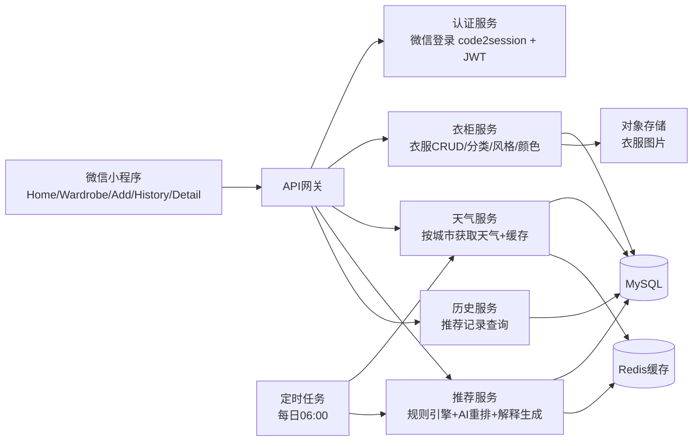

# AI穿衣指南微信小程序系统架构设计

基于原型文件 `dressguide.html`，系统聚焦 5 个页面流转：`首页`、`我的衣柜`、`添加衣服`、`历史穿搭`、`穿搭详情`，并满足如下目标：

- 根据每日天气与用户衣柜自动生成推荐
- 保证温度适配优先
- 考虑颜色与风格搭配
- 支持衣柜全流程管理与推荐历史追溯

## 1. 系统整体架构



### 分层说明

- 客户端层：微信小程序页面与交互承载
- 接入层：API网关统一鉴权、日志、限流
- 业务层：登录、衣柜、天气、推荐、历史服务拆分
- 数据层：MySQL（结构化数据）+ Redis（热点缓存）+ COS（图片）
- 调度层：每日定时推荐生成与补偿任务

### 核心流程

1. 用户微信登录，服务端创建/更新用户信息
2. 用户维护衣柜（上传图片、编辑分类/颜色/风格）
3. 系统获取城市当天天气并标准化
4. 推荐服务按温度筛选衣物、组合搭配、AI生成解释
5. 结果写入历史记录，首页直接读取当日推荐

## 2. 数据库表设计

## 2.1 用户与偏好

### `user`

| 字段 | 类型 | 说明 |
|---|---|---|
| id | bigint PK | 用户ID |
| openid | varchar(64) unique | 微信OpenID |
| unionid | varchar(64) null | 微信UnionID |
| nickname | varchar(64) | 昵称 |
| avatar_url | varchar(255) | 头像 |
| city_code | varchar(32) | 城市编码 |
| timezone | varchar(32) | 时区 |
| created_at | datetime | 创建时间 |
| updated_at | datetime | 更新时间 |

### `user_preference`

| 字段 | 类型 | 说明 |
|---|---|---|
| id | bigint PK | 主键 |
| user_id | bigint unique | 用户ID |
| preferred_styles | varchar(128) | 偏好风格（逗号分隔） |
| color_avoid | varchar(128) | 避免颜色 |
| cold_sensitivity | tinyint | 怕冷程度 1-5 |
| updated_at | datetime | 更新时间 |

## 2.2 衣柜

### `clothing_item`

| 字段 | 类型 | 说明 |
|---|---|---|
| id | bigint PK | 衣服ID |
| user_id | bigint idx | 所属用户 |
| name | varchar(64) | 名称 |
| category | enum | `top/pants/skirt/outer/shoes` |
| color_hex | varchar(16) | 主色（HEX） |
| style | enum | `casual/commute/sport` |
| season_tags | varchar(32) | `spring,summer,autumn,winter` |
| warmth_level | tinyint | 保暖指数 1-5 |
| thickness_level | tinyint | 厚度指数 1-5 |
| image_url | varchar(255) | 图片URL |
| remark | varchar(255) | 备注 |
| is_deleted | tinyint | 软删除标记 |
| created_at | datetime | 创建时间 |
| updated_at | datetime | 更新时间 |

> 说明：支持原型中的分类、颜色、风格和图片上传要求。

## 2.3 天气与推荐

### `weather_daily`

| 字段 | 类型 | 说明 |
|---|---|---|
| id | bigint PK | 主键 |
| city_code | varchar(32) idx | 城市 |
| date | date idx | 日期 |
| temp_current | decimal(4,1) | 实时温度 |
| temp_min | decimal(4,1) | 最低温 |
| temp_max | decimal(4,1) | 最高温 |
| humidity | int | 湿度 |
| wind_level | varchar(16) | 风力 |
| condition_text | varchar(32) | 天气描述 |
| source | varchar(32) | 数据来源 |
| fetched_at | datetime | 拉取时间 |

### `outfit_recommendation`

| 字段 | 类型 | 说明 |
|---|---|---|
| id | bigint PK | 推荐ID |
| user_id | bigint idx | 用户ID |
| rec_date | date idx | 推荐日期 |
| city_code | varchar(32) | 城市 |
| weather_id | bigint | 天气快照ID |
| theme | varchar(64) | 主题标签（如春日清爽） |
| style_label | varchar(32) | 主风格 |
| score | decimal(5,2) | 综合评分 |
| ai_comment | text | AI文案解释 |
| status | enum | `generated/accepted/replaced` |
| created_at | datetime | 创建时间 |

### `outfit_recommendation_item`

| 字段 | 类型 | 说明 |
|---|---|---|
| id | bigint PK | 主键 |
| recommendation_id | bigint idx | 推荐ID |
| clothing_item_id | bigint | 衣服ID |
| role | enum | `top/pants/skirt/outer/shoes` |
| match_score | decimal(5,2) | 单品匹配分 |

### `recommend_feedback`

| 字段 | 类型 | 说明 |
|---|---|---|
| id | bigint PK | 主键 |
| user_id | bigint idx | 用户ID |
| recommendation_id | bigint idx | 推荐ID |
| feedback_type | enum | `like/dislike/worn` |
| reason | varchar(128) | 反馈原因 |
| created_at | datetime | 创建时间 |

### `job_run_log`

| 字段 | 类型 | 说明 |
|---|---|---|
| id | bigint PK | 主键 |
| job_name | varchar(64) | 任务名称 |
| biz_date | date | 业务日期 |
| status | enum | `success/failed` |
| cost_ms | int | 执行耗时 |
| error_msg | varchar(255) | 错误信息 |
| created_at | datetime | 创建时间 |

## 3. 小程序页面结构

与原型一致，建议页面路由如下：

1. `pages/login/index`：微信登录
2. `pages/home/index`：天气卡片 + 今日推荐 + AI建议 + 换一套
3. `pages/wardrobe/index`：衣柜统计、筛选、列表网格
4. `pages/wardrobe-edit/index`：新增/编辑衣服（上传、分类、颜色、风格、季节）
5. `pages/history/index`：日历 + 历史推荐列表
6. `pages/recommend-detail/index`：当日推荐详情（单品、天气、AI点评）
7. `pages/profile/index`：城市设置、偏好设置

### TabBar（3项）

- 首页（home）
- 衣柜（wardrobe）
- 历史（history）

## 4. 后端 API 接口设计

## 4.1 认证

| 方法 | 路径 | 说明 |
|---|---|---|
| POST | `/api/v1/auth/wechat/login` | 微信 `code` 登录，签发 token |
| GET | `/api/v1/users/me` | 获取当前用户 |
| PUT | `/api/v1/users/me` | 更新昵称、城市等信息 |

## 4.2 衣柜管理

| 方法 | 路径 | 说明 |
|---|---|---|
| GET | `/api/v1/clothes` | 衣服列表（分类/风格/颜色筛选） |
| POST | `/api/v1/clothes` | 新增衣服 |
| GET | `/api/v1/clothes/{id}` | 衣服详情 |
| PUT | `/api/v1/clothes/{id}` | 编辑衣服 |
| DELETE | `/api/v1/clothes/{id}` | 删除衣服（软删） |
| POST | `/api/v1/clothes/upload` | 上传衣服图片，返回 URL |

## 4.3 天气

| 方法 | 路径 | 说明 |
|---|---|---|
| GET | `/api/v1/weather/today?cityCode=xxx` | 获取当天天气 |
| GET | `/api/v1/weather/hourly?cityCode=xxx` | 获取小时天气（可选） |

## 4.4 AI推荐

| 方法 | 路径 | 说明 |
|---|---|---|
| GET | `/api/v1/recommendations/today` | 获取今日推荐（无则实时生成） |
| POST | `/api/v1/recommendations/generate` | 手动换一套 |
| GET | `/api/v1/recommendations/{id}` | 推荐详情 |
| POST | `/api/v1/recommendations/{id}/feedback` | 点赞/点踩/已穿反馈 |

## 4.5 历史记录

| 方法 | 路径 | 说明 |
|---|---|---|
| GET | `/api/v1/history/calendar?month=2026-03` | 月历有记录日期 |
| GET | `/api/v1/history/list?page=1&pageSize=20` | 历史列表 |
| GET | `/api/v1/history/{date}` | 指定日期推荐详情 |

## 5. AI 推荐模块设计

## 5.1 推荐流程

1. 天气标准化：温度、温差、风力、降水
2. 温度筛选：按 `warmth_level` + `season_tags` 过滤
3. 组合生成：按模板组装候选（上衣+下装/裙装+鞋，必要时外套）
4. 多维打分：温度、颜色、风格、偏好
5. AI重排：对候选 TopN 做语言模型重排并生成解释文案
6. 落库与返回：保存推荐和明细，首页/历史复用

## 5.2 评分模型

```text
TotalScore = 0.45 * TempFit + 0.25 * ColorFit + 0.20 * StyleFit + 0.10 * UserPrefFit
```

- `TempFit`：温度区间与保暖指数匹配度（硬约束）
- `ColorFit`：同色系/邻近色/经典对比色规则
- `StyleFit`：单品风格一致性与可兼容性
- `UserPrefFit`：用户偏好与历史反馈

## 5.3 温度规则（示例）

- `<= 5°C`：必须含外套+长裤，鞋类优先保暖
- `6°C - 15°C`：建议外套可选，优先长袖
- `16°C - 24°C`：轻薄上衣+长裤/裙装，昼夜温差大时补充薄外套
- `>= 25°C`：轻薄透气，避免高保暖单品

## 5.4 每日自动生成

- 触发：每天 `06:00` 定时任务
- 执行：
  - 批量拉取已启用用户城市天气
  - 对每位用户生成 1 套默认推荐（可附 2 套备选）
  - 写入 `outfit_recommendation` 与 `outfit_recommendation_item`
- 容错：
  - 天气接口失败时使用最近一次缓存并标记降级
  - AI服务超时则退化为规则引擎推荐，保证可用性

---

该设计覆盖了原型中的所有核心交互，并满足需求中的 5 大功能模块与 4 条核心约束，可直接作为后端与小程序并行开发的蓝图。
